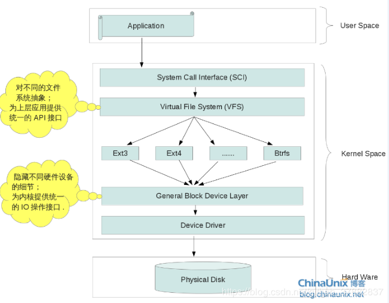
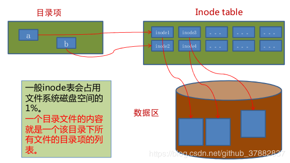

关于Linux文件系统，我还没有打算具体到源码或者内部深层原理去总结，只是大致了解他的整体架构，重点阐述inode节点和大致说明软连接和硬链接，ok,废话少说，开始总结。

首先，了解一下Linux在设计文件系统上的整体思想，如下图所示：

从下往上依次是物理设备，然后是驱动，由于硬盘类型有SATA，PATA，AHCI多种，导致驱动类型不一，为了给上面的文件系统统一的IO接口，Linux提供了通用的块设备层，方便上面的文件系统与下游驱动的IO，再上一层就是文件系统了，Linux提供了多种不通过类型的文件系统，ext2,ext3等等，因此又存在一个杂乱的问题，因此继续抽象成一个统一的虚拟文件系统，为上层提供统一的接口，于是用户侧就可以调用统一的接口了，比如open，close等等。不得不说，这种设计简单而又精妙，将杂乱的硬盘类型和文件系统抽象，给用户提供统一简单的接口，nice啊。
再细致的一层层说明等以后拜读源码之后再来填坑，现在我只想进入inode节点，看一下更接近用户侧的文件系统是怎么设计的。

简单来说，文件系统是操作系统对磁盘的抽象，当然我这里所要说明的是VFS这个抽象统一的虚拟文件系统，VFS之所以能够统一所有文件系统，在于提出了四个概念：超级块，inode,dentry和file
超级块：对应一个已装载的文件系统的信息，包括文件系统名称（比如 ext2）、文件系统的大小和状态、块设备的引用和元数据信息（比如空闲列表等等）。
inode:对应一个物理文件的元信息，包含文件属性和文件所存储的物理设备的位置。
dentry:目录项，记录文件名，文件inode指针
file:进程和磁盘文件的对应关系
如下图所示：

接下来说一下硬链接和软连接的区别
所谓的文件信息其实是由inode掌握的，所以硬链接文件其实和源文件是同一个inode,因此修改任何一方两者均会发生改变，比如mv命令其实就创建了一个硬链接，硬链接的命令为:
link/ln oldfile newfile
创建一个硬链接，系统会为其创建目录项，所以不同文件系统不可创建硬链接，也不可对目录创建硬链接。
而软连接与Windows快捷方式很像，只是记录了源文件的位置，在打开该文件时会指向该位置的文件。

